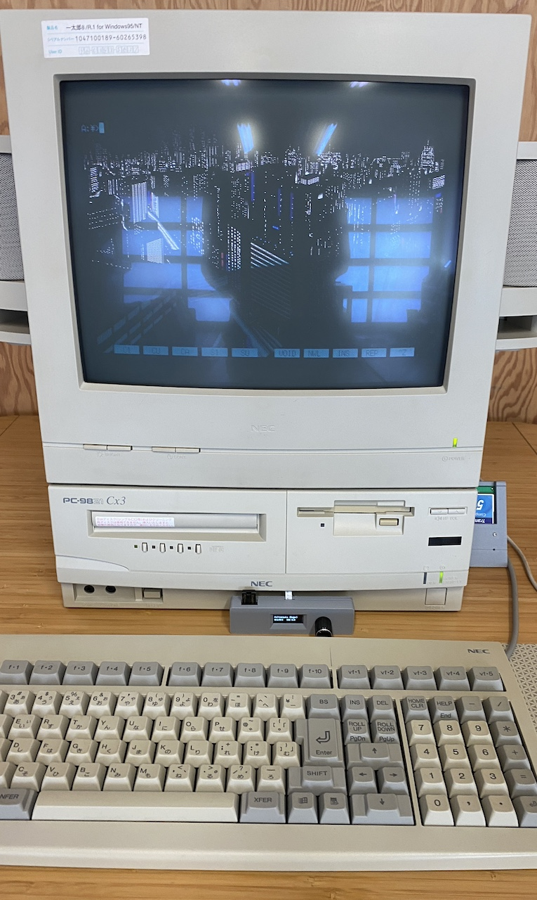
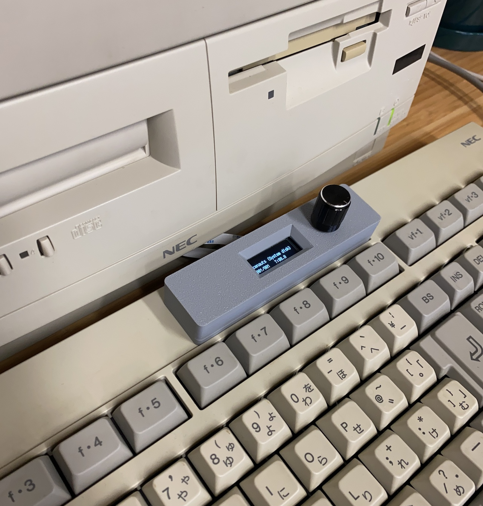
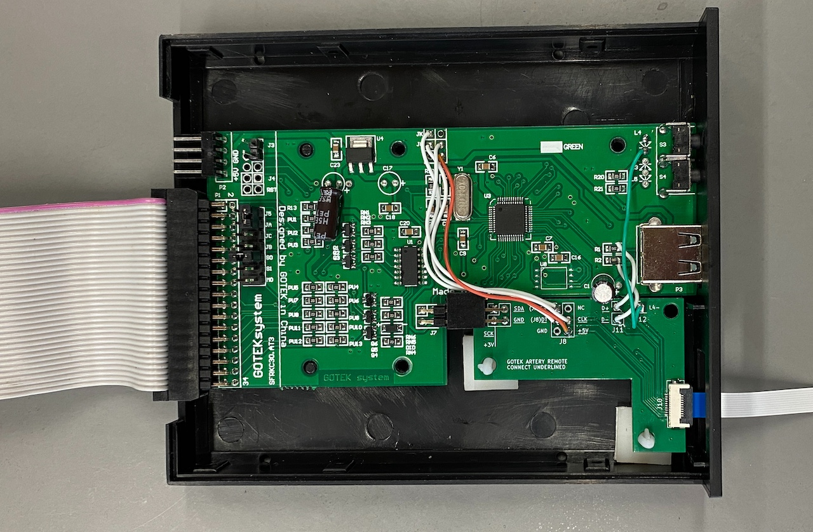

# Gotek Floppy Emulator Remote Interface

This is a device that relocates the USB, screen, and dial of a Gotek floppy drive emulator (running [FlashFloppy](https://github.com/keirf/flashfloppy)) to a standalone unit you can build yourself. It solves the problem of not having easy access to the drive, for example if your computer's front panel doesn't have a cutout for it. The remote connects to the main unit via a flat flex cable (FFC) which can be threaded through the narrowest of cracks in a desktop chassis, giving you the freedom to place it wherever you prefer.

## Building one

There are two (small) PCBs: One goes inside the Gotek, and the other forms the remote, along with a 3d printed case.

You'll need:

* A Gotek drive with [FlashFloppy](https://github.com/keirf/flashfloppy) installed
* A rotary encoder and 128x32 0.9" OLED screen recommended by [Hardware Mods](https://github.com/keirf/flashfloppy/wiki/Hardware-Mods)
* A USB-A through-hole female connector
* A 10-pin, 0.5mm pitch, straight-through FFC of the desired length (shorter is better)
* Two 10-pin, 0.5mm pitch, SMD FFC connectors
* An electrolytic capacitor for the USB connector, 10uF?
* Some M2 screws
* The two PCBs, fab-ready gerbers are available for the [breakout](pcb/production/gotek-breakout.zip) and [remote](pcb/production/gotek-remote.zip)
* A 3d printed case, print-ready STLs are available for the [top](3dp/Gotek Remote_Gotek Remote Dock v20_Case Top.stl) and [bottom](3dp/Gotek Remote_Gotek Remote Dock v20_Case Bottom.stl)
* Optional, a 2x2 right angle female 2.54mm pitch header pin socket
* Optional, two sticky-backed PCB standoffs 

Assembly:

Connect the underlined connections. J11 goes to the right side of R1 and R2 (in the same order, unlike this photo of an older version that had them reversed). Make an effort to have these USB jumper wires the same length, and as short as possible. The right-angle connector will make the board slip into place.

Using header pins is possible, but I found that there's not sufficient height to reassemble the Gotek case when doing so, and ended up soldering jumper wire to the pads.

Connect the FFC, put a 90° bend in it, being careful to crease and not fold all the way. Feed it through the hole left by the screen and out the front of your PC. Hook up the floppy side of things.

When assembling the remote, you'll probably have to desolder the angle pins of the rotary encoder and solder in straight ones. For both the rotary encoder and the OLED screen, the boards will be connected on the right side, so place a spacer on the left side to match height for better support - I use sticky tack.

Assemble the remote in this order:

1. Front side of the case
2. The remote PCB
3. Attach the FFC now before closing the case
4. Rear side of the case, screwing all the layers together

I use these options in [ff.cfg](https://github.com/keirf/flashfloppy/wiki/FF.CFG-Configuration-File#options):

* `display-type = oled-128x32-rotate-slow`
* `rotary = half`